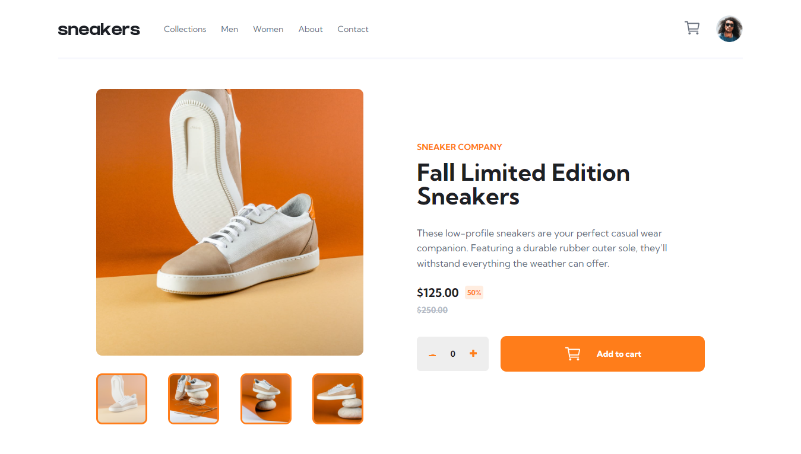
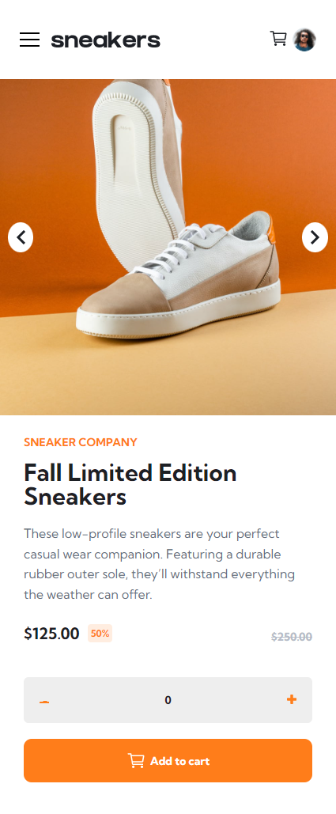

# Frontend Mentor - E-commerce product page solution

This is a solution to the [E-commerce product page challenge on Frontend Mentor](https://www.frontendmentor.io/challenges/ecommerce-product-page-UPsZ9MJp6). Frontend Mentor challenges help you improve your coding skills by building realistic projects.

### Screenshot

### Links

- Solution URL: [Add solution URL here](https://github.com/iliassel19/ecommercewebsite.git)
- Live Site URL: [Add live site URL here](https://comfy-starburst-f4cff9.netlify.app/)

## My process

### Built with

- Semantic HTML5 markup
- CSS custom properties
- Flexbox
- Desktop-first workflow
- Sass (Scss)
- Javascript

### What I learned

This challenge was a much training on my javascript learning and the application of the methods that I have learnt in the past 4 weeks.
The most thing that I used in this challenge was the forEach looping method on array to add style and so on.

Examples:

### Continued development

I think improving Not repeating myself on javascript code is my weakness

## Author

- Website - [Ilyass El Ouarti](https://comfy-starburst-f4cff9.netlify.app/)
- Frontend Mentor - [@iliassel19](https://www.frontendmentor.io/profile/iliassel19)
