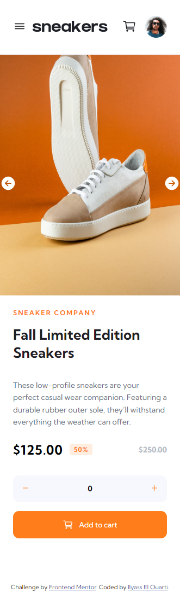
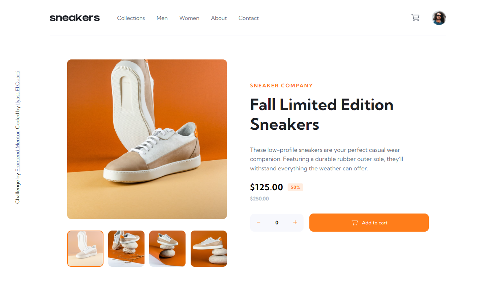

# Frontend Mentor - E-commerce product page solution

This is a solution to the [E-commerce product page challenge on Frontend Mentor](https://www.frontendmentor.io/challenges/ecommerce-product-page-UPsZ9MJp6). Frontend Mentor challenges help you improve your coding skills by building realistic projects.

## Overview

This challenge consist on creating an ecommerce-website of a shoe company.

### Screenshot

### Links

- Solution URL: [Add solution URL here](https://your-solution-url.com)
- Live Site URL: [Add live site URL here](https://your-live-site-url.com)

## My process

### Built with

- Semantic HTML5 markup
- CSS custom properties
- Flexbox
- JavaScript

### What I learned

This Challenge was a great practice for my javascript knowledge. I have succesfuly managed to do all the functionalities and I tried to implement some DRY on my code as much as I could and I avoided also using a lot of function to every thing.

## Author

- Frontend Mentor - [@iliassel19](https://www.frontendmentor.io/profile/iliassel19)
